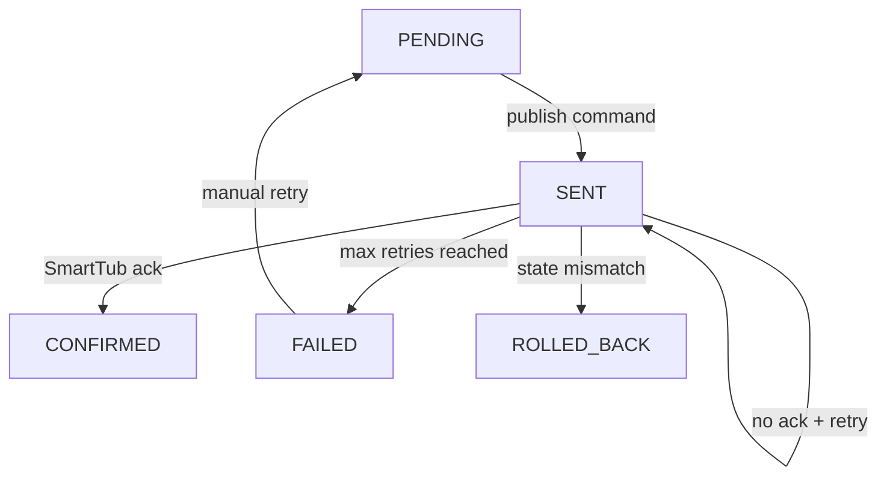

# Data Model: OpenHAB Whirlpool Integration

## Entity: WhirlpoolComponent
- **Purpose**: Represents a physical component (heater, pump, light, blower).
- **Fields**:
  - `id` (string) – unique identifier from SmartTub API.
  - `name` (string) – human-readable label derived from capability metadata.
  - `type` (enum) – `HEATER`, `PUMP`, `LIGHT`, `FILTER`, `SENSOR`, etc.
  - `state` (enum/string) – current value (on/off, numeric temperature, status code).
  - `attributes` (dict) – supplementary metrics (e.g., temperature setpoint, speed).
  - `allowed_commands` (list) – supported control operations for this component.
- **Relationships**: Aggregated by `StateSnapshot`; referenced by `ControlCommand` and Web UI views.
- **Validation Rules**:
  - `id` must remain stable across sessions.
  - `allowed_commands` must align with capability profile for the component type.

## Entity: CapabilityProfile
- **Purpose**: Captures features available for a specific tub configuration.
- **Fields**:
  - `tub_id` (string) – SmartTub device identifier.
  - `supported_components` (list of `WhirlpoolComponent.type`).
  - `command_matrix` (dict) – mapping of component type → commands (start, stop, set_temp).
  - `firmware_version` (string) – version reported by SmartTub API.
  - `last_discovered_at` (datetime) – timestamp of last capability refresh.
- **Relationships**: Governs creation of `WhirlpoolComponent` instances and Web UI control availability.
- **Validation Rules**:
  - Discovery must run on startup and every 24h or when SmartTub notifies firmware change.
  - Command matrix entries must exist for published MQTT command topics.

## Entity: StateSnapshot
- **Purpose**: Aggregated state of all components at a point in time.
- **Fields**:
  - `timestamp` (datetime) – UTC time of snapshot.
  - `components` (dict) – `component_id` → serialized `WhirlpoolComponent` state.
  - `source` (enum) – `SMARTTUB_POLL`, `COMMAND_CONFIRMATION`, `RECOVERY_SYNC`.
- **Relationships**: Exported to MQTT telemetry topics and Web UI; appended to audit log.
- **Validation Rules**:
  - New snapshot must diff against previous to avoid redundant MQTT publishes unless marked `RECOVERY_SYNC`.

## Entity: ControlCommand
- **Purpose**: Tracks lifecycle of a command issued via OpenHAB or Web UI.
- **Fields**:
  - `command_id` (uuid) – unique identifier for tracing.
  - `component_id` (string) – target component.
  - `action` (string/enum) – e.g., `TURN_ON`, `SET_TEMPERATURE`.
  - `parameters` (dict) – payload details, such as target temperature.
  - `status` (enum) – `PENDING`, `SENT`, `CONFIRMED`, `FAILED`, `ROLLED_BACK`.
  - `attempts` (int) – retry count.
  - `last_update` (datetime) – last status change.
  - `error_reason` (string, optional) – message when status is `FAILED` or `ROLLED_BACK`.
- **Relationships**: Generates updates for MQTT command response topics and audit log; displayed in Web UI history.
- **Validation Rules**:
  - Transition to `CONFIRMED` only after python-smarttub ack or state verification.
  - Max retry attempts (default 2) enforced before `FAILED`.

## Entity: LogEvent
- **Purpose**: Structured log entry.
- **Fields**:
  - `level` (enum) – `DEBUG`, `INFO`, `WARNING`, `ERROR`.
  - `timestamp` (datetime) – event time.
  - `source` (string) – module emitting the log.
  - `message` (string) – human-readable summary.
  - `context` (dict) – structured metadata (component_id, command_id, error details).
- **Relationships**: Streamed to stdout, optional file sink, and MQTT log topic.
- **Validation Rules**:
  - `level` must respect configured minimum log level.
  - Log events forwarded to MQTT must serialize to JSON and include `timestamp` + `level`.

## State Transitions

### ControlCommand Lifecycle

### Component Discovery Flow

1. On startup load cached capability profile (if available).
2. Fetch latest capabilities via python-smarttub.
3. Compare to cached profile; update MQTT meta topics and Web UI controls for additions/removals.
4. Schedule refresh (24h) or trigger on firmware change notification.

## Configuration Schema (Preview)

- `smarttub` block: credentials, polling interval, retry strategy.
- `mqtt` block: broker URL, credentials, base topic prefix, QoS defaults, retain flags.
- `web` block: host/port, optional basic auth, static asset path.
- `logging` block: level, MQTT forwarding toggle, structured output toggle.
- `docker` metadata: volume mounts (`/config`), environment variable keys.
